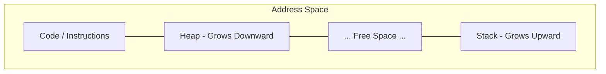

현대 운영체제에서 메모리 관리는 '추상화와 격리'의 핵심입니다. 시스템이 어떻게 여러 프로세스에게 독립적인 메모리 공간이라는 환상을 제공하는지, OSTEP의 메모리 관리 시리즈의 첫 번째 주제인 **13장 주소 공간(Address Spaces)**의 내용을 정리합니다.

---

## 1. 초기 시스템의 메모리 (Early Systems)
초기의 컴퓨터 시스템은 매우 단순했습니다. 한 번에 하나의 프로그램만 메모리에 올라왔고, 프로그램은 실제 **물리 메모리(Physical Memory)**의 주소를 직접 사용했습니다.

- **구조**: OS가 메모리의 일정 부분(예: 상위 64KB)을 점유하고, 나머지를 하나의 프로세스가 전부 사용하는 방식이었습니다.
- **문제점**: 사용자가 다른 프로그램을 실행하려면 기존 프로그램을 종료해야만 했습니다. 멀티태스킹이 불가능한 구조였죠.

## 2. 멀티프로그래밍과 시분할 (Multiprogramming & Time-sharing)
성능을 높이기 위해 여러 프로세스를 동시에 메모리에 올리는 **멀티프로그래밍**이 등장했습니다. OS는 한 프로세스가 I/O를 기다리는 동안 다른 프로세스로 CPU를 넘길 수 있게 되었죠. 

곧이어 **시분할(Time-sharing)**의 시대가 오면서 사용자 응답성이 중요해졌고, 각 프로세스가 메모리에 상주하며 빠르게 전환되어야 했습니다. 하지만 여기서 치명적인 문제가 발생합니다.

> **"A 프로세스가 실수로 B 프로세스의 메모리를 침범한다면?"**

이러한 **보호(Protection)**와 **격리(Isolation)**의 부재는 시스템 전체의 불안정을 초래했습니다. 이를 해결하기 위해 등장한 개념이 바로 **주소 공간(Address Space)**입니다.

## 3. 주소 공간 (Address Space)이란?
주소 공간은 OS가 실행 중인 프로그램에게 제공하는 **'메모리의 추상화'**입니다. 프로그램은 자신이 물리 메모리의 어디에 위치하는지 알 필요 없이, **0번지부터 시작하는 거대한 독립적인 메모리**를 가지고 있다고 착각하게 됩니다.

주소 공간은 크게 세 부분으로 구성됩니다:
1.  **Code (텍스트)**: 프로그램의 실행 명령어들이 담긴 정적 영역.
2.  **Stack**: 함수 호출, 지역 변수, 리턴 주소 등을 관리하는 영역. (위에서 아래로 확장)
3.  **Heap**: 동적으로 할당되는 메모리 영역. (아래에서 위로 확장)

## 5. Deep Dive: 아키텍트의 시선으로 본 주소 공간

단순히 "메모리를 가상화한다"는 사실보다 더 중요한 것은 그 속에 담긴 **엔지니어링 철학**입니다.

### ① 간접 참조의 원칙 (The Principle of Indirection)
컴퓨터 과학의 거장 데이비드 휠러는 **"컴퓨터 과학의 모든 문제는 또 다른 간접 계층(Indirection)을 도입함으로써 해결할 수 있다"**고 말했습니다. 
- 가상 메모리는 프로그램이 물리 주소를 직접 가리키는 대신, OS가 관리하는 **'가상 주소'라는 간접 계층**을 거치게 합니다. 
- 이 레이어 덕분에 OS는 프로그램 몰래 실제 물리 메모리를 옮기거나, 압축하거나, 심지어 디스크로 쫓아낼 수도 있는(Swapping) 엄청난 유연성을 확보하게 됩니다.

### ② 레이아웃 설계: 왜 Stack과 Heap은 서로 마주 보고 자라는가?
주소 공간의 배치를 보면 Stack은 위에서 아래로, Heap은 아래에서 위로 자라게 설계되어 있습니다. 
- **공간의 유연한 공유**: 만약 두 영역이 같은 방향으로 자란다면, 한 영역이 커질 때 다른 영역을 침범하지 않도록 미리 크기를 엄격히 제한해야 했을 것입니다. 
- 하지만 서로 마주 보게 배치함으로써, 가운데의 빈 공간(Free Space)을 필요에 따라 어느 한쪽이 더 많이 쓸 수 있도록 허용하는 **공간 최적화**를 달성했습니다.

### ③ 격리(Isolation)는 보안의 기초
현대 아키텍처에서 '격리'는 성능보다 우선시되는 경우가 많습니다. 가상 메모리는 프로세스가 자신의 주소 공간 외부를 "절대로 쳐다볼 수도 없게" 만듭니다. 
- 이는 단순히 버그를 방지하는 수준을 넘어, **샌드박싱(Sandboxing)**과 **멀티테넌트(Multi-tenant)** 환경을 가능케 하는 하드웨어 수준의 강력한 보안 경계가 됩니다.

---

## 6. 결론
주소 공간의 탄생은 프로그래머에게 물리적 하드웨어의 복잡성을 숨기고, 안전하고 효율적으로 개발할 수 있는 환경을 제공했습니다. 우리가 사용하는 현대적인 언어 런타임(GC 등)도 결국 OS가 제공한 이 가상 주소 공간이라는 토대 위에서 동작합니다.

---

> [!NOTE]
> 이 포스팅은 **Antigravity(AI Coding Assistant)**에 의해 작성되었습니다. 
> OSTEP의 핵심 내용을 바탕으로 정리된 요약본입니다.
