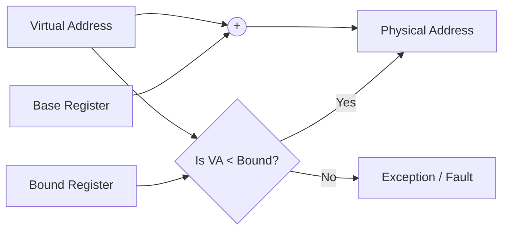

가상 메모리 시스템이 사용자에게 "모든 메모리를 독점하고 있다"는 환상을 심어주기 위해 가장 중요한 메커니즘은 무엇일까요? 바로 **주소 변환(Address Translation)**입니다. 15장에서는 하드웨어와 OS가 어떻게 협력하여 가상 주소를 물리 주소로 효율적이고 안전하게 변환하는지 그 기초 원리를 살펴봅니다.

---

## 1. 주소 변환의 핵심 아이디어
주소 변환의 목표는 간단합니다. 프로그램이 사용하는 **가상 주소(Virtual Address)**를 하드웨어가 실제 데이터를 찾을 수 있는 **물리 주소(Physical Address)**로 바꾸는 것입니다.

이 과정에서 OS는 다음 세 가지를 반드시 달성해야 합니다:
- **효율성(Efficiency)**: 변환 과정이 매우 빨라야 합니다.
- **제어(Control)**: 프로세스가 자신의 주소 공간 외부로 접근하지 못하게 격리해야 합니다.
- **유연성(Flexibility)**: 주소 공간을 물리 메모리의 어디든 자유롭게 배치할 수 있어야 합니다.

---

## 2. 동적 재배치 (Dynamic Relocation)
초창기에 고안된 가장 단순하면서도 강력한 방식은 **베이스와 바운드(Base and Bound)** 방식입니다.

### ① 베이스 레지스터 (Base Register)
- 프로세스의 주소 공간이 시작되는 물리 메모리의 주소를 담고 있습니다.
- **물리 주소 = 가상 주소 + 베이스**

### ② 바운드 레지스터 (Bound Register)
- 주소 공간의 크기를 제한하여 프로세스가 다른 영역을 침범하지 못하게 보호합니다.
- 만약 가상 주소가 바운드보다 크거나 0보다 작으면, CPU는 예외(Exception)를 발생시킵니다.

---

## 3. 하드웨어의 역할: MMU (Memory Management Unit)
주소 변환은 프로그램이 메모리에 접근할 때마다 발생합니다. 소프트웨어로 처리하기엔 너무 느리기 때문에, CPU 내부에 **MMU**라는 특별한 하드웨어 장치가 이 연산을 전담합니다.

- **Fast Execution**: 하드웨어 수준에서 덧셈과 비교 연산만으로 즉시 주소를 변환합니다.
- **Privileged Mode**: 베이스와 바운드 레지스터를 수정하는 작업은 오직 **커널 모드**에서만 가능하도록 제한하여 보안을 유지합니다.

---

## 4. 운영체제의 역할 (OS Responsibilities)
하드웨어가 빠른 변환을 담당한다면, OS는 그 토대를 관리합니다.

1.  **메모리 관리 (Memory Management)**: 비어 있는 물리 메모리 공간을 찾고(`Free List`), 프로세스에게 할당합니다.
2.  **문맥 교환 (Context Switch)**: 프로세스가 바뀔 때마다 해당 프로세스의 베이스/바운드 값을 하드웨어 레지스터에 다시 기록합니다.
3.  **예외 처리 (Exception Handling)**: 잘못된 메모리 접근이 발생했을 때 시스템을 보호하기 위해 해당 프로세스를 종료하거나 제어권을 회수합니다.

---

## 5. Deep Dive: 아키텍트의 시선으로 본 주소 변환

### ① 효율과 보호의 트레이드오프
베이스와 바운드 방식은 매우 빠르지만 단점도 명확합니다. 프로세스의 주소 공간 전체를 **연속된(Contiguous)** 물리 메모리에 배치해야 한다는 점입니다. 이는 메모리 사이에 작은 구멍들이 생기는 **외부 단편화(External Fragmentation)** 문제를 야기합니다. 현대 아키텍처는 이를 해결하기 위해 나중에 배울 '페이징(Paging)'이나 '세그멘테이션(Segmentation)'으로 발전하게 됩니다.

### ② 하드웨어와 소프트웨어의 협력 (Hardware-Software Synergy)
운영체제 설계의 아름다움은 **"하드웨어는 속도를 제공하고, 소프트웨어는 정책과 유연성을 제공한다"**는 협력 모델에 있습니다. 주소 변환은 이 철학이 가장 극명하게 드러나는 지점입니다.

---

## 6. 결론
주소 변환은 단순한 주소의 덧셈 그 이상의 의미를 갖습니다. 이는 OS가 하드웨어의 힘을 빌려 **'안전한 격리'**와 **'위치 독립성'**이라는 두 마리 토끼를 잡는 핵심 메커니즘입니다. 이 기초를 이해해야만 이후의 복잡한 가상 메모리 기법들을 온전히 이해할 수 있습니다.

---

> [!NOTE]
> 이 포스팅은 **Antigravity(AI Coding Assistant)**에 의해 작성되었습니다. 
> OSTEP의 메커니즘 시리즈, 주소 변환 편입니다.
